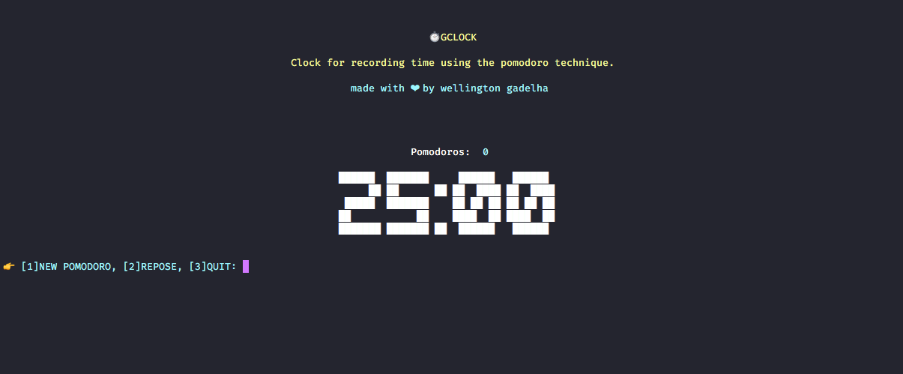

# Gclock
Clock for recording time using the pomodoro technique.

Play the timer and use the pomodoro technique to improve your time use.
Made to run on the terminal, without the need to open other external programs.

## Preview


## Install
Clone
```
git clone https://github.com/informeai/gclock.git
```
build
```
go build
```
## Usage
```
./gclock
```
### Obs
**gclock does not save state on your machine.**

made with :heart: by wellington gadelha.
